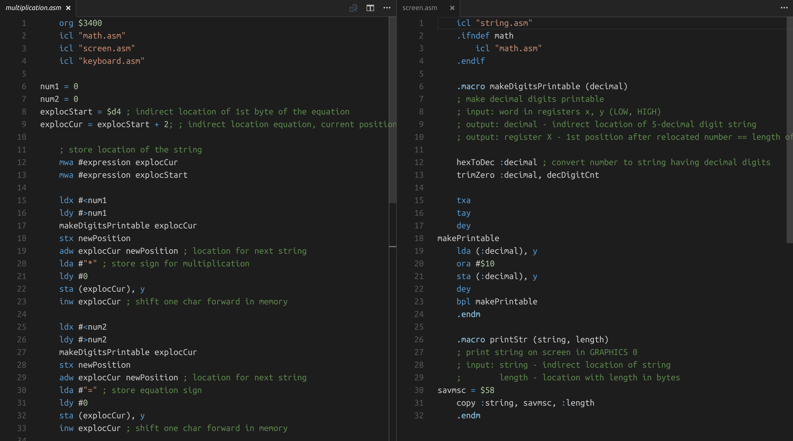

# MADS / 64tass assembly

It provides syntax highlighting for [MADS](http://mads.atari8.info/), powerful multi-pass cross assembler designed for 6502 and 65816 processors. Modified to suit the syntax of [64tass](http://tass64.sourceforge.net/) better.

## Features

It supports all features of MADS v2.0.6



## Installation

Until it's in the marketplace copy the contents of this repo into your `.vscode/extensions` folder. Windows (assuming VS Code terminal):

```
cp -R mads/* $USERPROFILE/.vscode/extensions/akosbalazs.mads-0.0.6/
```

Linux / macOS: replace `$USERPROFILE` with `~`. You can probably also use a different name.

-----------------------------------------------------------------------------------------------------------
**Go ATARI !**